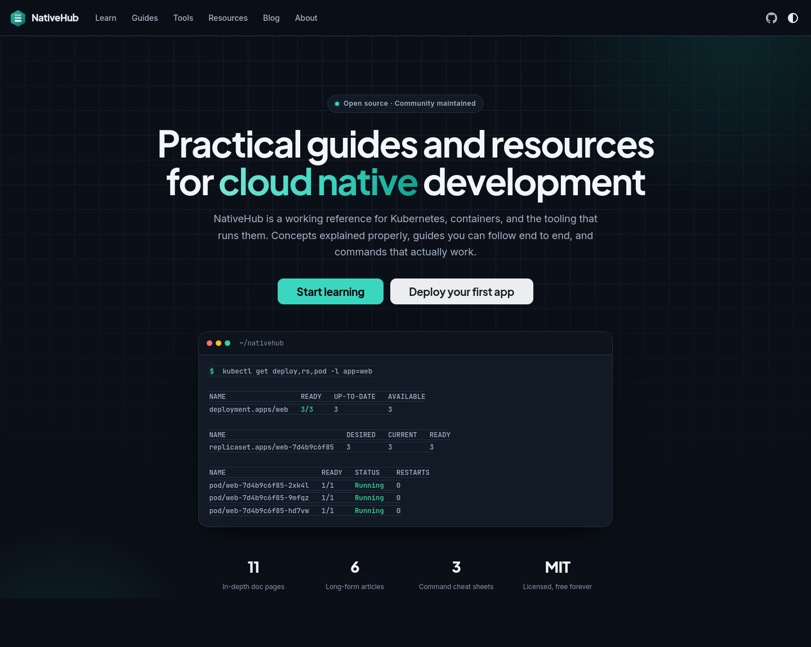
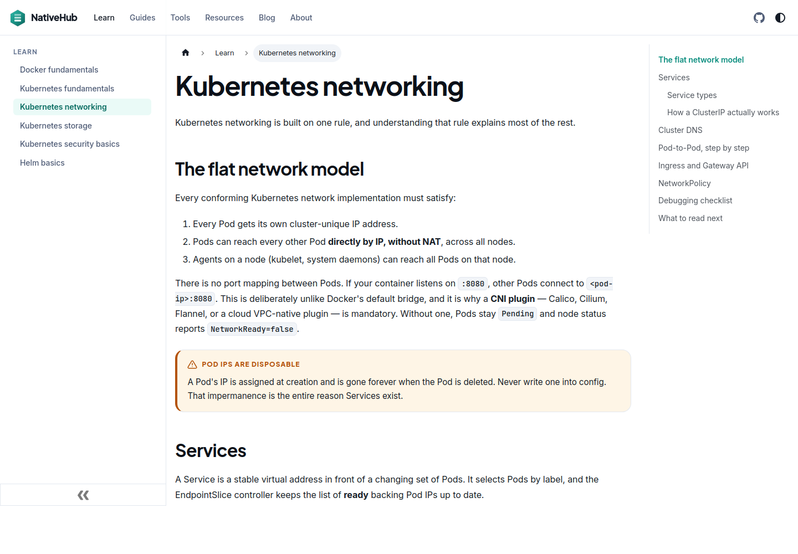
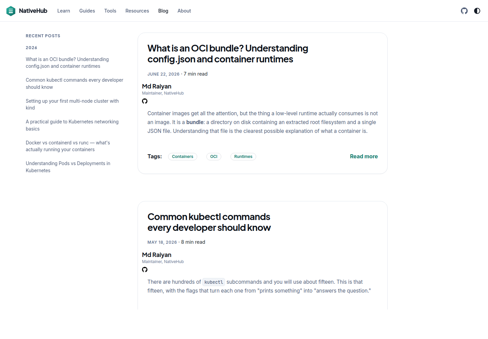
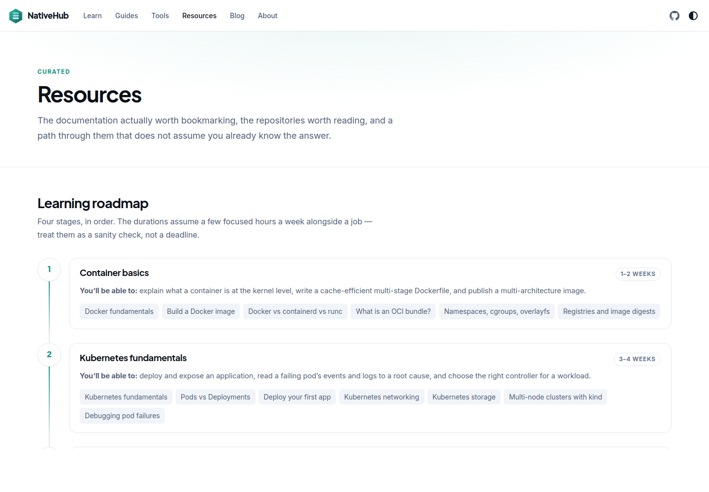

<div align="center">


# NativeHub

### Practical guides and resources for cloud native development

A production-quality documentation and learning hub for Kubernetes, containers, and the tooling
that runs them. Concepts explained properly, guides you can follow end to end, and commands that
actually work.

[](https://github.com/mdryaan/nativehub/actions/workflows/ci.yml)
[](https://github.com/mdryaan/nativehub/actions/workflows/links.yml)
[](./LICENSE)
[](https://docusaurus.io/)
[](https://nodejs.org/)

</div>

<p align="center">
  
</p>

---

## Screenshots

<table>
  <tr>
    <td width="50%">
      
      <p align="center"><strong>Docs</strong> — sidebar, TOC, callouts, code tabs</p>
    </td>
    <td width="50%">
      
      <p align="center"><strong>Blog</strong> — six long-form technical articles</p>
    </td>
  </tr>
  <tr>
    <td width="50%">
      
      <p align="center"><strong>Resources</strong> — curated links and a roadmap</p>
    </td>
    <td width="50%">
      
      <p align="center"><strong>Home</strong> — hero, feature cards, latest posts</p>
    </td>
  </tr>
</table>

---

## Features

- 📚 **11 in-depth doc pages** — six concept pages under _Learn_, five task walkthroughs under _Guides_
- ✍️ **6 long-form blog posts** — Pods vs Deployments, the containerd/runc stack, OCI bundles, and more
- 🧰 **3 searchable cheat sheets** — kubectl, docker, and helm, filterable by category
- 🔎 **Curated tool directory** — 18 real CLI tools with licences and upstream links, no affiliate junk
- 🗺️ **Learning roadmap** — a four-stage path from container basics to production practices
- 🎨 **Designed light and dark themes** — a full token system, not the stock Docusaurus palette
- 🧩 **7 reusable React components** — FeatureCard, CalloutBox, CheatSheetTable, CodeTabs, BlogPostCard, LearningRoadmap, ThemeToggle
- ⚡ **Live homepage blog preview** — generated by a custom Docusaurus plugin, never hand-maintained
- 📱 **Responsive** — verified at mobile, tablet, and desktop widths
- ♿ **Accessible** — WCAG AA contrast in both themes, keyboard navigable, `prefers-reduced-motion` respected
- 🔁 **RSS and Atom feeds** — no newsletter, no tracking
- 🚦 **CI on every PR** — build, broken-link check, ESLint, Prettier, and TypeScript

---

## Tech stack

| Layer               | Choice                                                                         | Why                                                                          |
| ------------------- | ------------------------------------------------------------------------------ | ---------------------------------------------------------------------------- |
| Framework           | [Docusaurus 3.10](https://docusaurus.io/)                                      | Docs and blog plugins, MDX, versioning-ready, first-class search             |
| UI                  | [React 19](https://react.dev/) + [TypeScript](https://www.typescriptlang.org/) | Typed components, strict `tsc --noEmit` in CI                                |
| Styling             | [Tailwind CSS 3](https://tailwindcss.com/) + CSS Modules + Infima              | Tailwind for layout utilities, modules for component styles, Infima for base |
| Content             | [MDX 3](https://mdxjs.com/)                                                    | Markdown that can import real React components                               |
| Syntax highlighting | [prism-react-renderer](https://github.com/FormidableLabs/prism-react-renderer) | YAML, bash, Dockerfile, JSON, Go, TOML, diff                                 |
| Quality             | ESLint 8 + Prettier 3                                                          | Zero-warning lint gate, formatting checked in CI                             |
| CI/CD               | [GitHub Actions](https://docs.github.com/actions)                              | Build, link check, lint, deploy to Pages                                     |
| Link checking       | [lychee](https://lychee.cli.rs/)                                               | External links, plus a weekly scheduled sweep                                |
| Hosting             | [GitHub Pages](https://pages.github.com/)                                      | Static output, deployed from `main`                                          |

---

## Architecture

```
nativehub/
├── .github/workflows/
│   ├── ci.yml                  build + lint + format + typecheck on every PR
│   ├── links.yml               lychee external link check (PR + weekly cron)
│   └── deploy.yml              build and publish to GitHub Pages
│
├── docs/                       the docs plugin's content root
│   ├── learn/                  concept pages     → /docs/learn/*
│   │   ├── docker-fundamentals.mdx
│   │   ├── kubernetes-fundamentals.mdx
│   │   ├── kubernetes-networking.mdx
│   │   ├── kubernetes-storage.mdx
│   │   ├── kubernetes-security-basics.mdx
│   │   └── helm-basics.mdx
│   └── guides/                 task walkthroughs → /docs/guides/*
│       ├── deploy-first-app.mdx
│       ├── build-docker-image.mdx
│       ├── write-first-helm-chart.mdx
│       ├── setup-cicd-github-actions.mdx
│       └── debugging-pod-failures.mdx
│
├── blog/                       six posts + authors.yml + tags.yml
│
├── src/
│   ├── components/             one directory per component, each with its own styles
│   ├── pages/                  index.tsx, tools.tsx, resources.tsx, about.tsx
│   ├── css/
│   │   ├── custom.css          the design system: tokens → Infima overrides → chrome
│   │   └── tailwind.css        Tailwind layers (preflight disabled)
│   └── theme/                  swizzled components
│       ├── Footer/             brand block, config-driven columns, feed links
│       └── NotFound/           custom 404
│
├── static/                     copied verbatim: logo, favicon, social card, screenshots
├── docusaurus.config.ts        site config, Tailwind PostCSS wiring, latest-posts plugin
├── sidebars.ts                 two independent sidebars: learnSidebar, guidesSidebar
└── tailwind.config.js          brand ramps, display font, preflight/container disabled
```

### Three design decisions worth knowing

**Tailwind is additive, not a replacement.** `preflight` and `container` are disabled in
`tailwind.config.js` so Infima keeps ownership of base element styles and its own `.container`.
Tailwind supplies layout and spacing utilities on top; component-specific styling lives in CSS
Modules. This avoids the reset war that usually follows dropping Tailwind into Docusaurus.

**One token system, two themes.** `src/css/custom.css` is layered: design tokens (`--nh-*`) at the
top, Infima variable overrides (`--ifm-*`) pointing at them next, then component chrome. Dark mode
redefines tokens only. Components never hard-code a colour, which is why both themes look
deliberate rather than inverted.

**The homepage blog preview is generated.** A small plugin in `docusaurus.config.ts` reads each
post's front matter at build time, maps tag keys to their labels from `blog/tags.yml`, estimates
reading time, and exposes the result as global data. Publishing a post updates the homepage with no
other edits.

---

## Local development

**Requirements:** Node.js 20+ (CI uses 22) and npm 10+.

```bash
git clone https://github.com/mdryaan/nativehub.git
cd nativehub

npm install
npm run start      # http://localhost:3000/nativehub/
```

> [!NOTE]
> The `/nativehub/` path is the configured `baseUrl` — visiting `http://localhost:3000/` alone
> gives you a 404.

```bash
npm run build      # production build; fails on broken links and anchors
npm run serve      # serve the production build locally
```

### All scripts

| Command                | What it does                                |
| ---------------------- | ------------------------------------------- |
| `npm run start`        | Dev server with hot reload                  |
| `npm run build`        | Production build into `build/`              |
| `npm run serve`        | Serve the production build                  |
| `npm run typecheck`    | `tsc --noEmit`                              |
| `npm run lint`         | ESLint over `src/`, zero warnings tolerated |
| `npm run lint:fix`     | ESLint with autofix                         |
| `npm run format`       | Prettier, write mode                        |
| `npm run format:check` | Prettier, check mode — what CI runs         |
| `npm run clear`        | Clear the Docusaurus cache                  |

Run this before opening a PR — it is exactly what CI runs:

```bash
npm run build && npm run lint && npm run format:check && npm run typecheck
```

---

## How content is organised

Four places, four different jobs:

| Location       | Route                            | Use it for                         | Shape                                |
| -------------- | -------------------------------- | ---------------------------------- | ------------------------------------ |
| `docs/learn/`  | `/docs/learn/*`                  | Explaining a concept               | Reference. Read in any order.        |
| `docs/guides/` | `/docs/guides/*`                 | Accomplishing a task               | Numbered steps, start to finish.     |
| `blog/`        | `/blog/*`                        | An article with a date and a view  | Narrative, with a truncation marker. |
| `src/pages/`   | `/tools`, `/resources`, `/about` | A page that is not primarily prose | Bespoke React.                       |

**Docs** are registered explicitly in `sidebars.ts` — nothing is autogenerated, so a new page will
not appear until you add its id. Each page carries an "Edit this page" link and a "Last updated"
stamp derived from git history.

**Blog posts** need a `slug`, a `date`, an author defined in `blog/authors.yml`, tags defined in
`blog/tags.yml`, and a `{/* truncate */}` marker. The build is configured to throw on unknown
authors, unknown tags, and untruncated posts, so mistakes fail fast rather than shipping.

**Pages** are plain React routes. They import the same components MDX does, so a cheat sheet looks
identical whether it appears on `/tools` or inside a blog post.

Full instructions for each are in [CONTRIBUTING.md](./CONTRIBUTING.md).

---

## Quality and accessibility

CI runs on every pull request:

| Check          | Tool               | Gate                                            |
| -------------- | ------------------ | ----------------------------------------------- |
| Build          | `docusaurus build` | Fails on any broken internal link or anchor     |
| External links | lychee             | Fails on dead links; weekly cron opens an issue |
| Lint           | ESLint 8           | `--max-warnings=0`                              |
| Formatting     | Prettier 3         | `--check`                                       |
| Types          | TypeScript         | `tsc --noEmit`                                  |

### Accessibility checklist

Treated as a build requirement rather than a nice-to-have. Every page is checked against:

- [x] **Contrast** — body text meets WCAG AA (4.5:1) in **both** themes; link and callout colours are
      lightened in dark mode specifically to clear the threshold
- [x] **Heading hierarchy** — exactly one `h1` per page, levels step down one at a time
- [x] **Keyboard navigation** — every interactive element is reachable and operable by keyboard
- [x] **Visible focus** — a 2px focus ring is never suppressed; `:focus-visible` is styled globally
- [x] **Alt text** — meaningful on informational images, `aria-hidden="true"` on decorative SVGs
- [x] **Semantic landmarks** — `header`, `main`, `nav`, `footer`, plus a skip-to-content link
- [x] **Labelled controls** — search inputs, filter groups, and toggles have accessible names and
      `aria-pressed` state
- [x] **Reduced motion** — all animation and transition durations collapse under
      `prefers-reduced-motion: reduce`
- [x] **No horizontal scroll** — wide tables and code blocks scroll inside their own container, never
      the page
- [x] **Theme persistence** — the colour choice is stored in `localStorage` and applied before first
      paint, so there is no flash of the wrong theme

To audit a build yourself:

```bash
npm run build && npm run serve
npx lighthouse http://localhost:3000/nativehub/ \
  --only-categories=accessibility,performance,seo,best-practices --view
```

---

## Deployment

`deploy.yml` builds and publishes to GitHub Pages using the official Pages actions with OIDC
rather than a deploy key. It checks out with `fetch-depth: 0` so the "Last updated" timestamps come
from real commit dates.

Publishing is **manual by design** — nothing goes live until you ask for it:

1. Enable Pages: **Settings → Pages → Source: GitHub Actions**.
2. Run the workflow: `gh workflow run deploy.yml`, or use the Actions tab.

The site then lives at `https://mdryaan.github.io/nativehub/`. If you would rather publish on every
merge, change the workflow's trigger back to `push` on `main`.

To host it elsewhere, update `url`, `baseUrl`, `organizationName`, and `projectName` in
`docusaurus.config.ts`, then serve the contents of `build/` from any static host.

---

## Contributing

Corrections are the most valuable contribution — this site is only useful if it is right.

Every doc page has an **Edit this page** link that takes you straight to the source file. For
anything larger, [CONTRIBUTING.md](./CONTRIBUTING.md) covers the environment setup, how to add a
doc page, a blog post, or a component, the writing standard, branch and commit conventions, and the
PR checklist.

---

## License

[MIT](./LICENSE) © 2026 Md Raiyan

Content and code alike. Reuse it, adapt it, teach from it — attribution is appreciated but not
required.
